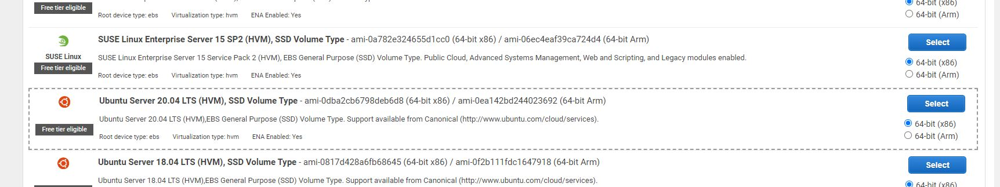
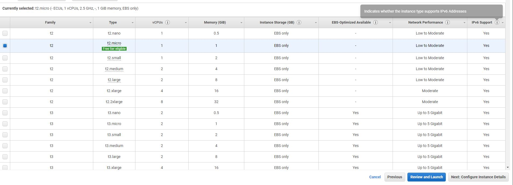
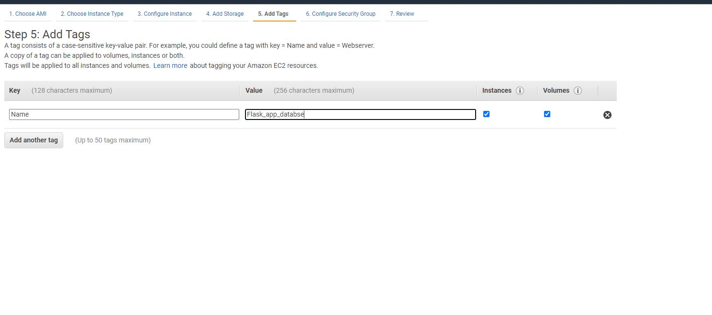
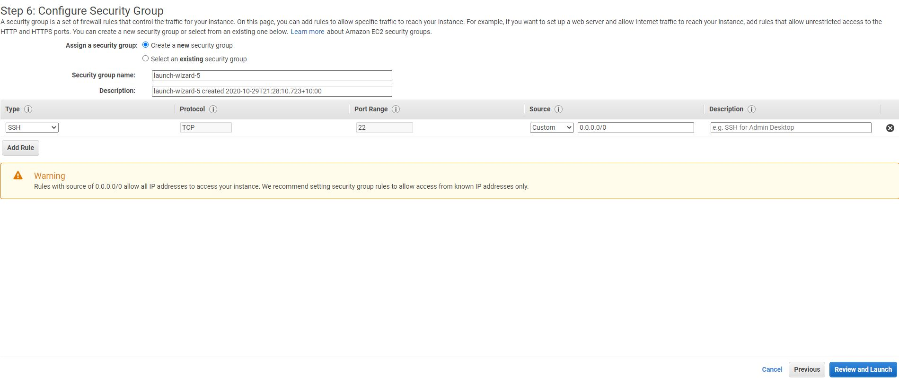
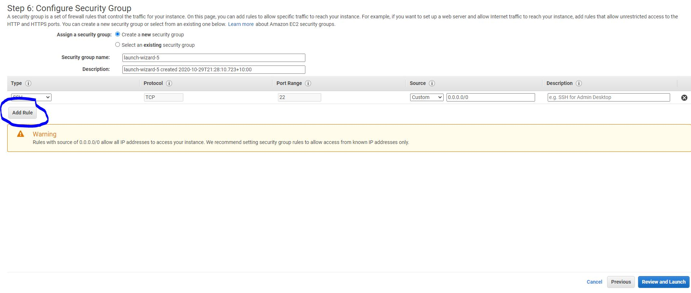
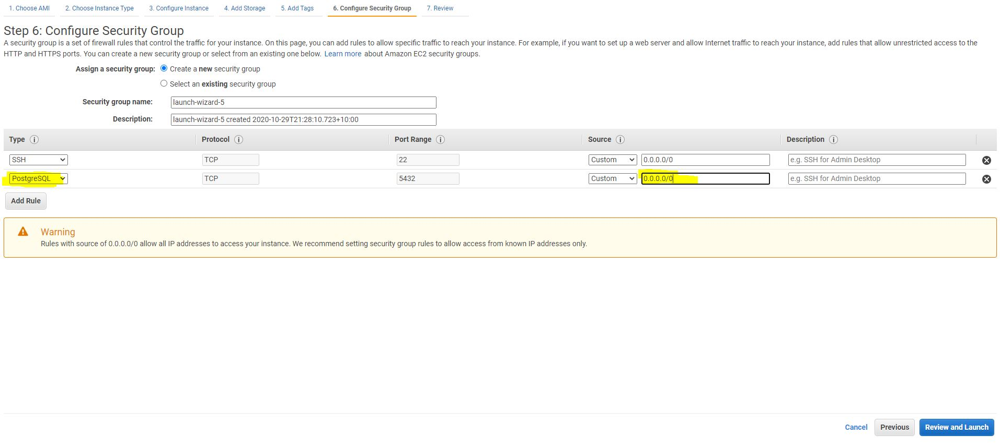

# EC2 creation for POSTGRES SQL

Very brief overview for creating an EC2 instance and connecting remotely through Python scripts. This is the set up configuration only at a very base level without taking into consideration neccesary security steps in limiting IP access etc etc.

## Create EC2 instance

1. Choose Ubuntu Server 64 bit

2. Select appropriate tier (t2 micro free in this case) 

3. Select Next Configure Instance Details
4. Select Next Add Storage (unless custom settings required)
5. Storage has been left as the default in this instance
6. Select Next Add tags

7. As a minimum a tag with a key value of name should be specified to identify your instance

8. Select next and you should now be on the security page

9. Next add a rule
 
10.  Rule type PostgresSQL, Source set to 0.0.0.0/0

11. Select Review and Launch
12. Choose key pair or existing key pair. Make sure you are of possesion of the key if choosing new key pair.
13. Launch Instance

## SSH into instance

1. Take note of public IP address for the created instance eg:ec2-54-88-60-6.compute-1.amazonaws.com or 54.88.60.6. If an elastic IP has not been set then these could change and need to be updated
2. Check the permissions of the key that was downloaded in the previous section step 10. Navigate to where the key was saved in your system then:
    ```
    :~/key$ ls -l
    total 8
    -rwx------ 1 colforst colforst 1700 Oct 27 13:17 aws_educate.pem
    -rwx------ 1 colforst colforst 1692 Oct 26 15:56 duck.pem
    :~/key$
    ```
    This checks the permissions of the key. Both keys here have permissions set for only the owner which is what we want. The command required to set these permissions for duck for example is:

    ```
    :~/key$ chmod 700 duck.pem
    ```
3. Now we can use this key to connect to our instance. You can either be in the folder that the key is in or type the absolute path. For example:

   This command can be used with the absolute path
    ```
    :~$ ssh -i /home/colforst/key/duck.pem ubuntu@54.88.60.6
    ```
    Or this command can be used if in the folder
    ```
    :~/key$ ssh -i duck.pem ubuntu@54.88.60.6
    ```
   Also note ubuntu is the user name of the instance we created

4. OPTIONAL ONLY - if we are always connecting to an instance we can set a config file to enable us to write a shortcut to connect. It is basically the steps as outlined previously but put into a script. 
   1. Go to your .ssh directory. The standard directory is in /home/username
   ```
   :~$ pwd
   /home/colforst
   :~$ ls -a
   .   .bash_history  .bashrc  .config     .ipython  .jupyter    .local       .mume     .psql_history  .python_history  .sudo_as_admin_successful  .vscode-server  .xsession         key
   ..  .bash_logout   .cache   .gitconfig  .john     .landscape  .motd_shown  .profile  .pylint.d      .ssh             .viminfo                   .wget-hsts      .xsession#enable
   ```
   I have used the ls -a command to show hidden files and we can see the .ssh file is in there.
   2. Create the config file in the .ssh folder
   ```
   :~$ cd .ssh
   :~/.ssh$ touch config
   ```
   3. Open the file usingL
   ```
   :~/.ssh$ vim config
   ```
   4. The edits are as follows.
   ```
   Host *
       PORT 22
   Host ec2db
       HostName 54.88.60.6
       User ubuntu
       IdentityFile /home/colforst/key/duck.pem
   ```
   The host ec2db was created by me and is now the shortcut to connect to the system. With this file in place I can now connect to the instance with:

   ```
   :~$ ssh ec2db
   ```
   as the command. You can enter more then one connection with the config file and also use it with keys stored in id_rsa.

## Install POSTGRES SQL on EC2 instance

1. SSH into the ec2 instance and install postgres.
   ```
   sudo apt update
   sudo apt-get install postgresql
   ```
2. Login into the postgres shell using:
   ```
   sudo -u postgres psql
   ```
3. Postgres sql is now running on the instance. However it has not been set up for remote queries or inputs from say a python script.

## Upddate POSTGRES SQL for access remotely using python scripts.

1. Log into postgres on the ec2 instance as outlined in step 2 of the previous section.
2. Type the following command and copy the path that is listed.
   ```
   SHOW config_file;
   ```
   The path listed comes out as:
   ```
    /etc/postgresql/12/main/postgresql.conf
   ```
3. Exit postgres sql and type the following in your command console to open this file to edit.
   ```
   sudo vim /etc/postgresql/12/main/postgresql.conf
   ```
   Go down the page until you find:
   ```
   #listen_addresses = 'localhost'
   ```
   Uncomment the line and change the above to
   ```
   listen_addresses = '*'
   ```
   Postgres sql will know be listening to all addresses. Save and exit vim
4. Type the following command and copy the path that is listed.
   ```
   SHOW hba_file;
   ```
   The path listed comes out as:
   ```
    /etc/postgresql/12/main/pg_hba.conf
   ```
5. Exit postgres sql and type the following in your command console to open this file to edit.
   ```
   sudo vim /etc/postgresql/12/main/pg_hba.conf
   ```
   Scroll down to the very bottom where the entries are as follows:
   ```
   # replication privilege.
   local   replication     all                                     peer
   host    replication     all             127.0.0.1/32            md5
   host    replication     all             ::1/128                 md5
   ```
   Create a new line and enter the following on the new line
   ```
   host    all             all             0.0.0.0/0               md5
   ```
   The table should now look like this:
   ```
   # replication privilege.
   local   replication     all                                     peer
   host    replication     all             127.0.0.1/32            md5
   host    replication     all             ::1/128                 md5

   host    all             all             0.0.0.0/0               md5
   ```
   Postgres sql will now also accept requests from all IP addresses. Save and exit vim.
6. Now that these changes have been made restart postgres sql:
   ```
   sudo service postgresql restart
   ```
7. Add a password to the user postgres. First log into postgres shell as per previous step
   ```
   ALTER ROLE postgres WITH PASSWORD 'postgres';
   ```
   In this example postgres has been used as the password


   


